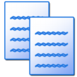

# Mercury patch manifest 

## Firefox 153.0.3 patch layout

The versioned patches in `patches/firefox-153/` apply only to
`FIREFOX_153_0_3_RELEASE` (`0c39e9282688363f5028d0541c17784f7fa5117c`):

| Patch | Purpose |
| --- | --- |
| `010-mercury-default-preferences.patch` | Audited Mercury preference defaults |
| `020-mercury-customizable-ui.patch` | Mercury toolbar defaults and UI migrations |
| `030-mercury-app-branding.patch` | Mercury title for early Windows launcher errors |
| `040-mercury-distribution-policy.patch` | Package Mercury's `distribution/policies.json` |
| `050-mercury-build-configuration.patch` | Select Mercury branding and build-time product options |
| `060-mercury-default-bookmarks.patch` | Mercury's default toolbar bookmarks on the Firefox 153 template |
| `070-mercury-windows-installer.patch` | Windows installer branding, MSIX color, isolated reset marker, and disabled Mozilla uninstall survey |
| `080-mercury-localization.patch` | Mercury-specific About dialog and network error wording |
| `100-mercury-lto-tuning.patch` | Raise Clang's ThinLTO import instruction limit for Mercury performance builds |
| `110-mercury-devtools-branding.patch` | Use Mercury branding for the local `about:debugging` runtime without replacing remote Firefox and Fenix channel icons |
| `120-debian-package-identity.patch` | Allow Firefox's Debian repackager to keep Mercury's package name and installation path separate from its remoting identity |
| `130-mercury-plugin-container-branding.patch` | Use Mercury's company name in the Windows `plugin-container.exe` version resource |
| `140-mercury-langpack-identity.patch` | Give Mercury language packs a product-specific ID and keep runtime fallback, crash reporter and MSIX packaging consistent |
| `150-mercury-user-agent-compatibility.patch` | Keep Mercury's network User-Agent Firefox-compatible without replacing Firefox 153's HTTP handler |
| `160-mercury-profileserver-software-rendering.patch` | Make PGO profile generation independent of target GPU and driver availability |
| `170-mercury-windows-sfx-branding.patch` | Brand the Windows 7-Zip self-extractor source and report Mercury's Windows 10 minimum |

## Source overlays

Mercury-owned files remain as source overlays rather than patches:

- `app/mercury.exe.manifest`: selected automatically for `mercury.exe` by the
  Windows build rules.
- `app/module.ver`: eight-line Windows branding resource. It remains an overlay
  because Firefox's legacy source contains a Windows-1252 copyright byte while
  Mercury's file is UTF-8; a Git binary patch would be harder to audit.
- `app/distribution/policies.json`: independently maintained product policy.
- `browser/branding/mercury/`: independently maintained Mercury artwork and
  branding resources, rebased on Firefox 153's `unofficial` branding layout.
  Reproducible source notes for the custom private-browsing PNGs and DMG volume
  icon live under `browser/branding/mercury/source/`.
  Mercury's two-layer Icon Composer source is maintained under
  `browser/branding/mercury/macos/AppIcon.icon`. The manually dispatched
  `.github/workflows/rebuild-macos-assets-car.yml` workflow compiles it with a
  pinned Xcode toolchain, validates the `AppIcon` catalog, and uploads the
  generated `Assets.car` and provenance sidecars without modifying the
  repository. The validated catalog is checked in beside `firefox.icns` and is
  copied and packaged by Firefox 153's native macOS rules. `CFBundleIconName`
  selects its `AppIcon` entry on current macOS releases, while `firefox.icns`
  remains the legacy fallback. Firefox/Nightly `Assets.car` files must never
  be copied into Mercury branding. Standard ten-rendition sources for the
  legacy application, document-association, and DMG volume icons live in
  `browser/branding/mercury/macos/{LegacyAppIcon,DocumentIcon,DiskIcon}.iconset`.
  The manually dispatched
  `.github/workflows/rebuild-macos-legacy-icons.yml` workflow compiles and
  round-trip-validates `firefox.icns`, `document.icns`, and `disk.icns` with
  Apple's `iconutil`, then uploads them and their provenance files as artifacts
  without changing the repository.
- `other-licenses/7zstub/firefox/{7zSD.Win32.sfx,7zSD.ARM64.sfx,setup.ico}`:
  product-branded binary inputs for Firefox's full Windows installer. The two
  SFX executables are checked in because Firefox packaging also consumes
  prebuilt stubs and must work without a separately configured Visual Studio
  toolchain. Their editable resource changes live in patch `170`; see the
  adjacent `README.mercury` for provenance and rebuild requirements. The
  manually dispatched `.github/workflows/rebuild-windows-sfx.yml` workflow
  performs the pinned Firefox checkout, x86/ARM64 rebuild, validation,
  attestation, and artifact upload without modifying the repository.

## Removed legacy overlays

The obsolete Firefox 129 overlays `app/Makefile.in`, `app/application.ini`, and
`app/splash.rc` were removed. Firefox 153 generates `application.ini` from
`build/application.ini.in` and automatically embeds the executable manifest.

The obsolete Firefox 129 copies of `build/application.ini.in` and
`build/moz.configure/{lto-pgo,toolchain}.configure`, plus the unused
`build/codename.txt`, were removed. Mercury's CPU and optimization flags remain
in the platform mozconfigs; the only retained build-system source change is the
versioned ThinLTO tuning patch above.

The Firefox 129 whole-file `toolkit/moz.configure` overlay was also removed.
Its only Mercury-specific delta enabled JPEG XL outside Nightly, which Firefox
153 already does upstream. Language-pack identity changes now live in patch
`140`, without replacing thousands of current toolkit configuration lines.

The old whole-file overlays under `browser/base`, `browser/components`,
`browser/installer`, `browser/locales`, and the top level of `browser/` were
removed. Product changes to current Firefox files now live in the versioned
patches above; only `browser/branding/mercury/` remains as a browser overlay.

The seven duplicated `devtools/client/themes/images/aboutdebugging-*.svg`
overlays were removed. They replaced every remote Firefox and Fenix channel
icon with the Mercury logo. Patch `110` instead points only the local
`about:debugging` sidebar entry at Mercury's shared branding resource and
leaves upstream remote-runtime icons intact.

The old `ipc/app/module.ver` overlay differed from Firefox only in the Windows
company-name field. Patch `130` now carries that product-specific change while
preserving the rest of Firefox 153's `plugin-container.exe` version resource.
Git encodes this one-line change as a binary patch only because the upstream
file is stored with unnormalized CRLF line endings.

The Firefox 129 `netwerk/protocol/http/nsHttpHandler.cpp` overlay differed from
its upstream baseline by one User-Agent compatibility line. Patch `150` carries
that line on Firefox 153 and avoids reverting the current HTTP implementation.

The old whole-file profileserver preference overlay was replaced by patch
`160`, which carries only Mercury's still-valid software-rendering preference
on the Firefox 153 profileserver defaults.

The old recursive `other-licenses/` overlay was removed. Mercury does not
replace Firefox's copy of the LZMA SDK or its build projects. Setup now copies
only the two product-branded prebuilt SFX executables and their source icon;
the `resource.rc` changes are applied to Firefox 153 by patch `170`. The
prebuilt executables must be regenerated whenever the pinned Firefox 7zstub
source changes.

Mercury does not enable Firefox's Windows stub installer. Releases contain
multiple CPU-specific installers and do not provide the single signed payload
and certificate identity required by the upstream stub download flow.

Mercury's Debian package uses Firefox's `mach repackage deb` implementation.
The product-specific templates live in `packaging/debian/`; the old committed
`dist/` root filesystem and its duplicated icons, compressed documentation,
static dependency list, and legacy MIME registration were removed.

Mercury-specific `zh-CN` and `zh-TW` wording is maintained separately under
`l10n/patches/firefox-153/`. These patches apply to the pinned Firefox
localization repository, not to the Firefox source checkout. See
[`LOCALIZATION.md`](LOCALIZATION.md).
